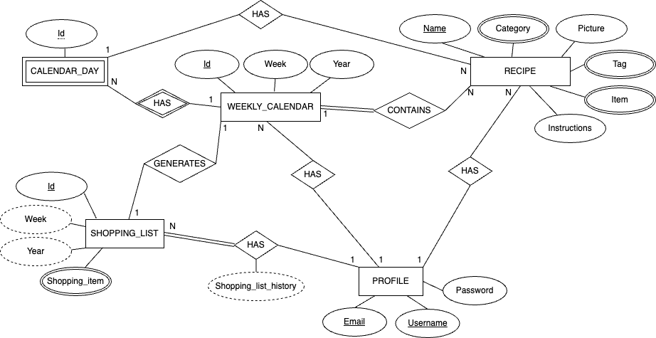
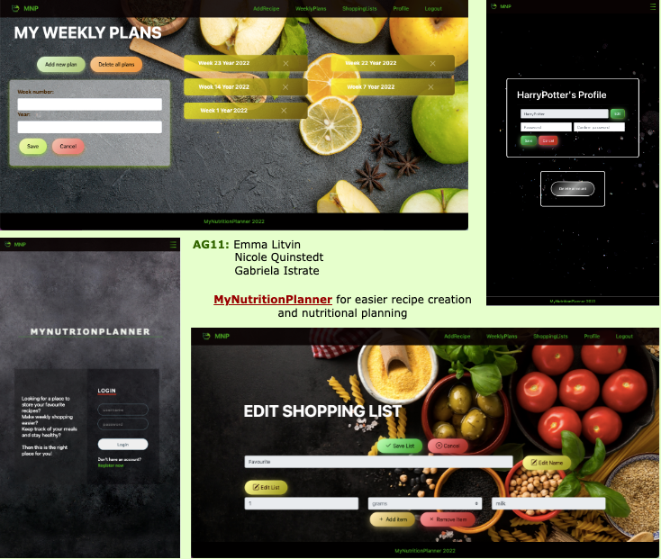

# Backend and Frontend Template

Latest version: https://git.ita.chalmers.se/courses/dit341/group-00-web (public Github [mirror](https://github.com/dit341/group-00-web))

## Project Structure

| File        | Purpose           | What you do?  |
| ------------- | ------------- | ----- |
| `server/` | Backend server code | All your server code |
| [server/README.md](server/README.md) | Everything about the server | **READ ME** carefully! |
| `client/` | Frontend client code | All your client code |
| [client/README.md](client/README.md) | Everything about the client | **READ ME** carefully! |
| [docs/DEPLOYMENT.md](docs/DEPLOYMENT.md) | Free online production deployment | Deploy your app online in production mode |
| [docs/LOCAL_DEPLOYMENT.md](docs/LOCAL_DEPLOYMENT.md) | Local production deployment | Deploy your app local in production mode |

## Requirements

The version numbers in brackets indicate the tested versions but feel free to use more recent versions.
You can also use alternative tools if you know how to configure them (e.g., Firefox instead of Chrome).

* [Git](https://git-scm.com/) (v2) => [installation instructions](https://www.atlassian.com/git/tutorials/install-git)
  * [Add your Git username and set your email](https://docs.gitlab.com/ce/gitlab-basics/start-using-git.html#add-your-git-username-and-set-your-email)
    * `git config --global user.name "YOUR_USERNAME"` => check `git config --global user.name`
    * `git config --global user.email "email@example.com"` => check `git config --global user.email`
  * > **Windows users**: We recommend to use the [Git Bash](https://www.atlassian.com/git/tutorials/git-bash) shell from your Git installation or the Bash shell from the [Windows Subsystem for Linux](https://docs.microsoft.com/en-us/windows/wsl/install-win10) to run all shell commands for this project.
* [Chalmers GitLab](https://git.ita.chalmers.se/) => Login with your **Chalmers CID** choosing "Sign in with" **Chalmers Login**. (contact [support@chalmers.se](mailto:support@chalmers.se) if you don't have one)
  * DIT341 course group: https://git.ita.chalmers.se/courses/dit341
  * [Setup SSH key with Gitlab](https://docs.gitlab.com/ee/ssh/)
    * Create an SSH key pair `ssh-keygen -t ed25519 -C "email@example.com"` (skip if you already have one)
    * Add your public SSH key to your Gitlab profile under https://git.ita.chalmers.se/profile/keys
    * Make sure the email you use to commit is registered under https://git.ita.chalmers.se/profile/emails
  * Checkout the [Backend-Frontend](https://git.ita.chalmers.se/courses/dit341/group-00-web) template `git clone git@git.ita.chalmers.se:courses/dit341/group-00-web.git`
* [Server Requirements](./server/README.md#Requirements)
* [Client Requirements](./client/README.md#Requirements)

## Getting started

```bash
# Clone repository
git clone git@git.ita.chalmers.se:courses/dit341/group-00-web.git

# Change into the directory
cd group-00-web

# Setup backend
cd server && npm install
npm run dev

# Setup frontend
cd client && npm install
npm run serve
```

> Check out the detailed instructions for [backend](./server/README.md) and [frontend](./client/README.md).

## Visual Studio Code (VSCode)

Open the `server` and `client` in separate VSCode workspaces or open the combined [backend-frontend.code-workspace](./backend-frontend.code-workspace). Otherwise, workspace-specific settings don't work properly.

## System Definition (MS0)

### Purpose

**MyNutritionPlanner** allows users to add their favourite recipes, schedule them for each day of the week and get an auto generated shopping list for better and easier grocery shopping. Along with extra features of manually modifying the shopping list and browsing the history of them **MyNutritionPlanner** becomes an irreplaceable food shopping tool that allows users to save time and money while eating favourite home made dishes.


### Pages

* **Welcome:** The page displays welcome message and has two buttons allowing a new user to register and an already existing user to sign in. In case if the user has forgotten the password, there is a "Forgot password" link at the bottom of the page that allows the user to reset password using their secret question.
* **Registration:** The page prompts the user to fill in five fields (email, user name, password, secret question, answer) and the buttons "Add icon" (allowing user to optionally add profile image) and "Register" (to confirm and complete registration).
* **Forgot password:** This page displays the secret question that user set up upon registartion and the field for user to input the answer to the question and "Submit" button.
* **User home page:** The page contains buttons "Profile", "Recipes", "Weekly calendar", "Shopping list" and "History" that allow the user to navigate within the website/application.
* **Profile:** The page contains information provided by the user upon registration and has buttons "Edit" (allowing the user to change the profile information) and "Save" (to save the changes).
* **Recipes:** The page has buttons "Add new recipe" (allowing the user to add new recipe) and "All recipes" (to review all existing recipes).
* **Add new recipe:** The page contains the fields that the user can fill in with the contents and quantities of the ingredients and buttons "Add image" (allowing the user to add dish image to the recipe) and "Save" (to save new recipe).
* **All recipes:** The page contains a list of all saved recipes and allows the user to browse and review them.
* **Saved recipe:** The page displays the dish image, list of ingredients and their quantities and buttons "Edit" (allowing the user to modify the recipe) and "Delete" (to remove the recipe).
* **Weekly calendar:** The page displays the number of calendar week and seven small windows for each day with "+" button in each window allowing the user to add saved recipes to each day of the week. Also this page has a "Generate shopping list" button that allows the user to save all scheduled meals for the week and create a preliminary shopping list according to scheduled recipes.
* **Shopping list:** The page contains a list of items and their quantities according to the last saved weekly calendar along with the buttons "Add another item" (allowing the user to add item manually to the list) and "Save changes" (to save modified shopping list).
* **History:** The page has a list with links to all previously saved shopping lists and allows the user to review it by clicking on the link for every list.

### Entity-Relationship (ER) Diagram



## Teaser (MS3)


